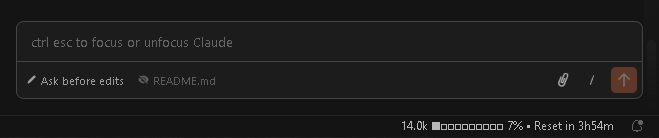
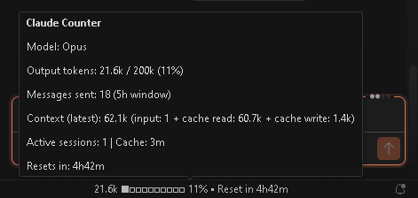

# Claude Code Token Usage Tracker

A lightweight VSCode/Cursor extension that displays real-time Claude Code token usage directly in your status bar.

## Features

- **Token count** — Shows current conversation token usage (e.g. `142.5k`)
- **Context window %** — How full your context window is, with color-coded warnings (yellow >65%, red >85%)
- **Cache status** — Whether prompt caching is active and time remaining on the 5-minute cache window (The cache typically has a 5-minute time-to-live (TTL) for Pro/API users.)
- **Session countdown** — Time remaining in your 5-hour Claude Code session


## How it looks






---

## How It Works

The extension reads Claude Code's JSONL log files from `~/.claude/projects/`, finds recently modified logs, and parses token usage data from them. All metrics are scoped to a **fixed 5-hour session window** that mirrors Anthropic's actual rate limit behavior.

### Session Window Detection

The extension automatically detects when a new 5-hour session begins by analyzing gaps in your usage history. When there is a gap of more than 5 hours between API calls (e.g. after hitting a rate limit and waiting), the first message after that gap is recognized as the start of a new session window. The "Reset in" timer counts down from this detected start point, and when it expires all counters reset to zero.

### Other Details

- **Active sessions** counts log files with activity in the last 10 minutes, reflecting actually running Claude Code instances.
- **Streaming deduplication** — Claude Code logs multiple JSONL entries per API call during streaming (each with cumulative token values). The extension deduplicates by `requestId`, keeping only the final entry per call.
- **Cross-project tracking** — scans all subdirectories of `~/.claude/projects/`, so usage across different projects is combined into a single session view.

## Settings

| Setting | Default | Description |
|---------|---------|-------------|
| `claudeCounter.contextWindow` | `200000` | Context window size in tokens. All current Claude models (Opus, Sonnet, Haiku) use a 200k context window for Pro users. Max, Team, and Enterprise subscriptions have access to a 1M context window. |
| `claudeCounter.refreshIntervalSeconds` | `3` | How often the status bar refreshes (in seconds). |

## Installation

### From VSIX

1. Download the `.vsix` file
2. In VSCode/Cursor: `Extensions` > `...` > `Install from VSIX...` 
   OR press CTRL+SHIFT+P > `Extensions: Install from VSIX...` and select the Claude Statusbar VSIX file.

### From Source

```bash
git clone https://github.com/REPOZY/Claude-Code-Usage-Tracker
cd claude-counter-statusbar
npm install
npm run compile
```


## Requirements

- VSCode ^1.85.0 or Cursor
- Claude Code must be installed and have been used at least once (so log files exist in `~/.claude/projects/`)
